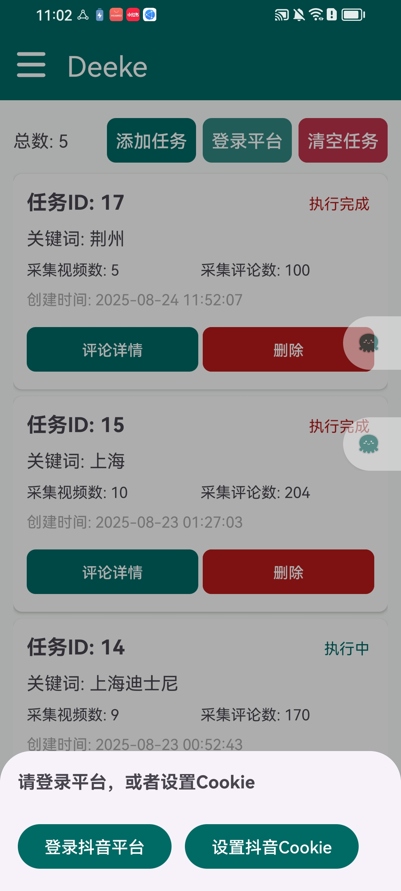
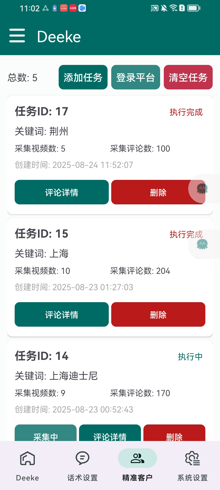
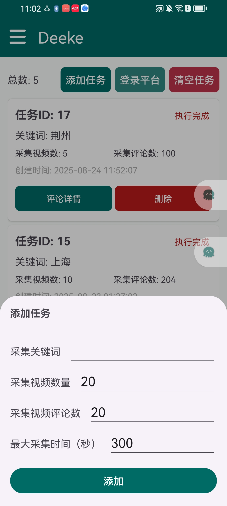
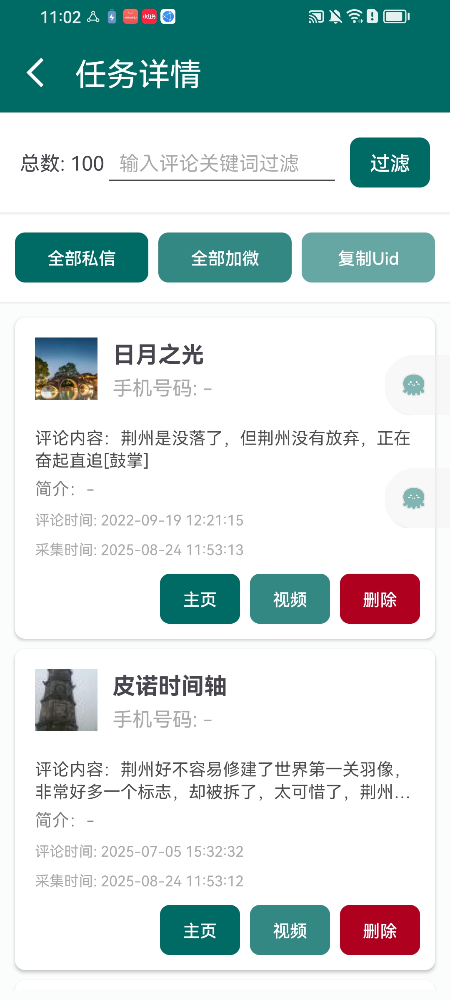

# 抖音评论区uid、手机号采集/小红书评论区采集工具

#### 介绍

抖音/小红书评论区采集客户端和App（Api采集）、抖音评论区UID、抖音用户uid采集工具，根据视频关键词采集，采集后的用户uid，可以批量私信、加微信；支持Android、Mac和Windows系统。

#### Android端截图（全网为数不多，自主研发，可贴牌）
> Android端可以采集简介手机号、批量私信、批量加微信

    
    
    
    

#### 电脑端截图

#### 使用说明

1. 下载安装包
2. 激活码激活
3. 平台选择界面点击“抖音平台”或者“小红书平台”
4. 主界面点击“登录抖音”，软件会自动打开Chrome浏览器（没有安装可以先安装）
5. 扫码登录抖音账号，短信验证（或者扫脸验证）
6. 填写视频关键词，点击“搜索”
