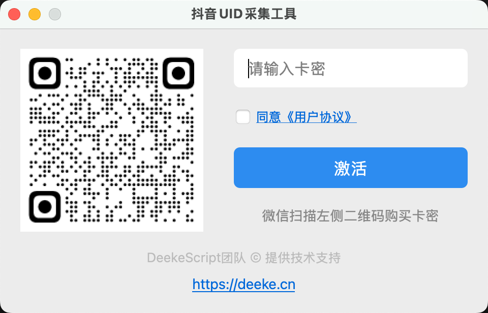
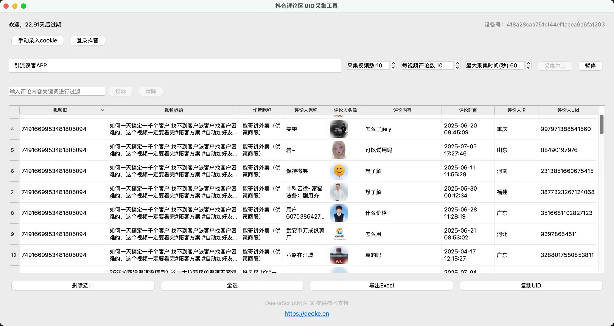
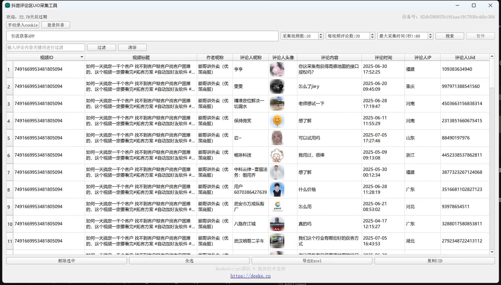

# 抖音UID采集工具

#### 介绍

抖音uid采集、抖音评论区UID、抖音用户uid采集工具，根据视频关键词采集，采集后的用户uid，可以通过Deeke软件批量私信；支持Mac和Windows系统。

#### 截图

#### 使用说明

1. 下载安装包
2. 激活码激活
3. 主界面点击“登录抖音”，软件会自动打开Chrome浏览器（没有安装可以先安装）
4. 扫码登录抖音账号，短信验证（或者扫脸验证）
5. 填写视频关键词，点击“搜索”
